# SNICK TV

**Saturday night, 1992, running in your browser.**

A 3D CRT television that streams real, complete SNICK broadcasts — commercials
and all — straight from the Internet Archive. One HTML file, no build, no
backend, no video hosted here.

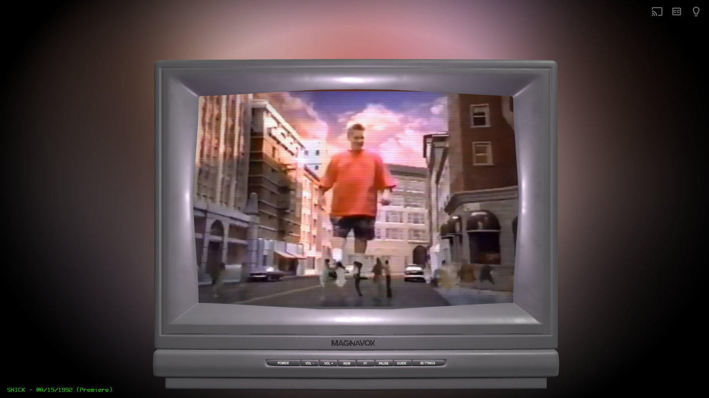

## What this is

SNICK was Nickelodeon's Saturday-night block (1992–1999): *Clarissa Explains It
All*, *Roundhouse*, *The Ren & Stimpy Show*, *Are You Afraid of the Dark?*, and
later *All That*, *Kenan & Kel*, and more. A community of VHS archivists has
preserved dozens of complete broadcast tapes on the Internet Archive — original
commercials, promos, and channel bumpers intact.

This project plays those tapes the way they were meant to be seen: on a curved
piece of glass in a dark room. It is a single self-contained HTML file that
renders a Magnavox 19" CRT in 3D, glues a live streaming video onto its screen,
and recreates the glow a television throws around a room. **72 broadcasts** are
in the dial, spanning the premiere on August 15, 1992 through January 1998.

| | |
|---|---|
| 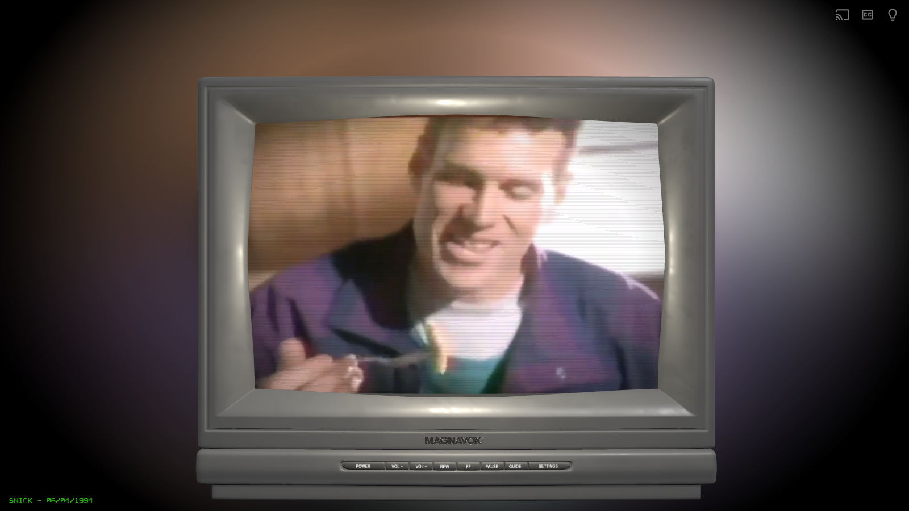 | 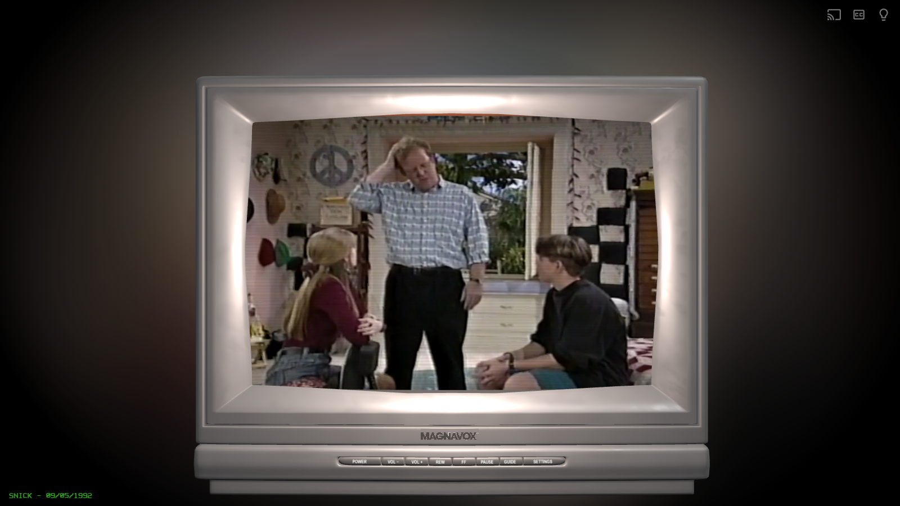 |
| 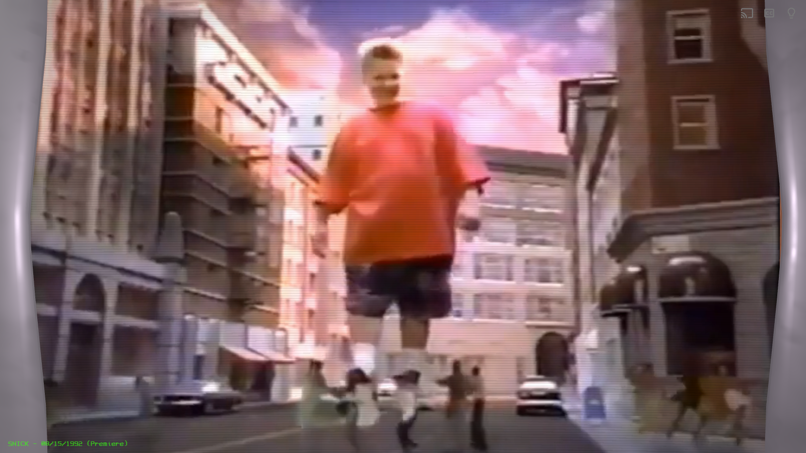 | 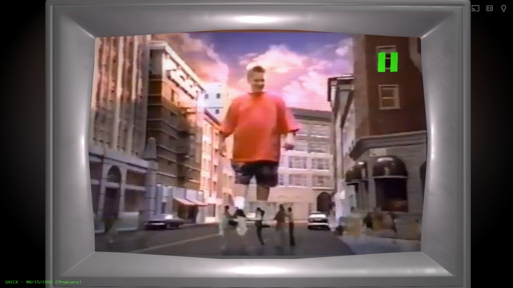 |

## Features

### A real CRT, not a video in a rectangle

- **3D Magnavox TV** you can orbit and zoom (drag to orbit, wheel to zoom —
  from the whole cabinet down to the glass nearly filling your view).
- **Barrel distortion** — the picture bulges like real curved glass, done with
  an SVG displacement-map filter.
- **Scanlines and corner vignette** on the glass, all display-only and all
  toggleable.
- **Ambilight** — a blurred twin of the video washes the wall behind the TV,
  like a lit screen in a dark room.
- **Shell glow** — a point light tinted by the current picture's average color
  plays across the cabinet and bezel, easing between shades as scenes change.
- **Lights switch** (the bulb icon, top-right) — flip between a dark den and
  a bright room. The ambilight only shows with the lights out, the way it
  should.

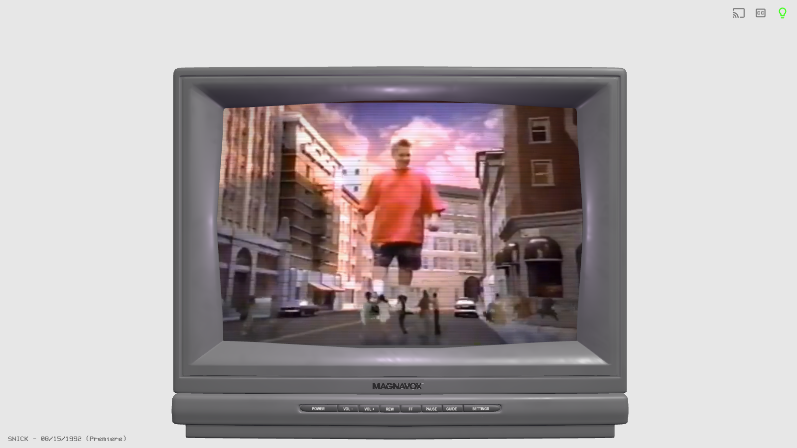

### A TV you operate like a TV

The front panel has eight working buttons — POWER, VOL −, VOL +, REW, FF,
PAUSE, GUIDE, SETTINGS — with silkscreen labels projected onto the actual
button geometry. Clicks are raycast against the 3D model, so you press the
physical TV, not an overlay.

**GUIDE** (or right-click anywhere) opens the episode list on the screen
itself. Episodes you've finished are starred. Scroll with the wheel, click one
to tune in.

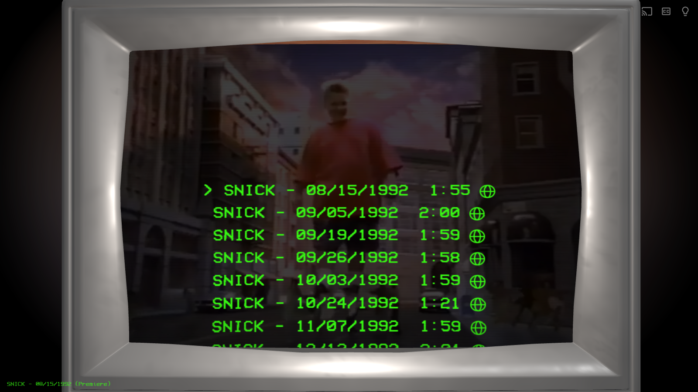

**SETTINGS** opens a proper old-TV picture menu: overlay dimming, scanlines,
bulge, captions, and the classic four — BRIGHTNESS, CONTRAST, COLOR, TINT —
with chunky slider bars. Settings persist between visits.

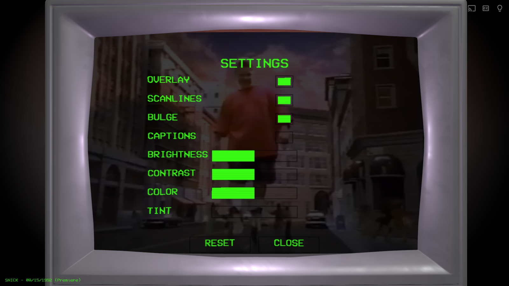

### It knows what you're watching

Each SNICK broadcast is four half-hour shows. FF/REW (or clicking the screen's
left/right edges) snap between show boundaries, and an on-screen popup tells
you which show you just landed on and the original air date — the lineup data
is reconstructed per-era from the schedule history, so a 1992 tape announces
*Roundhouse* and a 1997 tape announces *Kenan & Kel*.

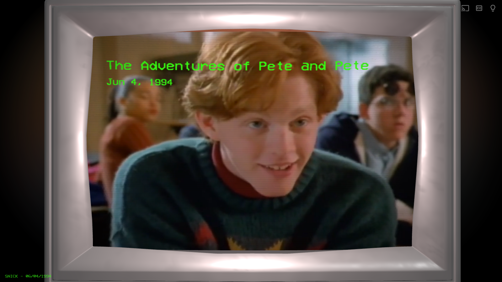

### Volume, captions, casting

- Click (or click-and-hold) the screen's top/bottom edges or the VOL panel
  buttons; a green segment meter pops up. Hover cues fade in over each touch
  zone so everything is discoverable.
- **Closed captions**, machine-generated with Whisper, cover every episode
  in the dial and render as real VTT tracks in green VCR type, wrapped to fit
  inside the curved glass. Toggle with the CC badge or in SETTINGS.
- **CAST** sends the raw video stream to a real TV via the browser's Remote
  Playback API, while the 3D set keeps playing at home. It needs a
  Cast-capable device on your network and a browser with cast discovery
  enabled (Chrome, mainly — Edge and Brave ship with it off); if nothing is
  reachable, the corner label tells you so.

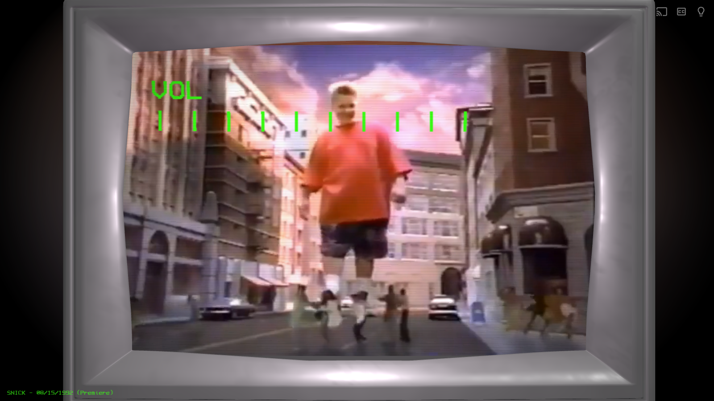

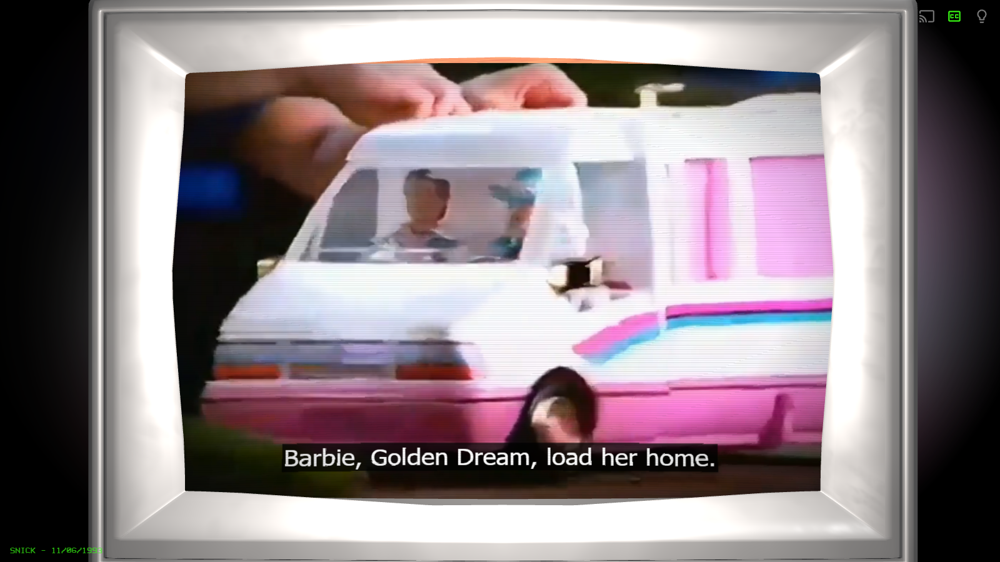

### It remembers

Watch progress saves every few seconds. Close the tab mid-episode and the next
visit resumes where you left off. Episodes auto-advance when they end, and
anything that fails to stream is skipped automatically.

## Controls

| Input | Action |
|---|---|
| Drag | Orbit the TV |
| Wheel | Zoom (or scroll the GUIDE list when it's open) |
| Click screen center | Pause / play |
| Click screen left / right edge | Previous / next show block |
| Click screen top / bottom edge | Volume up / down |
| **Hold** FF / REW (button or screen edge) | Scrub with acceleration, release to jump |
| **Hold** VOL (button or screen edge) | Ramp volume smoothly |
| Right-click | Open / close the GUIDE |
| Double-click | Fullscreen |
| Panel buttons | POWER · VOL − · VOL + · REW · FF · PAUSE · GUIDE · SETTINGS |
| Bulb / CC / cast icons (top-right) | Room lights · captions · cast to a TV |

## How it works

The whole thing is one HTML file and two data files. There is no server,
no proxy, and no video stored in this repo.

- **The screen is a real `<video>` element**, placed inside the 3D scene by
  three.js's `CSS3DRenderer` and revealed through a depth-only "hole" punched
  in the WebGL cabinet. The browser merely *displays* the stream — no pixel
  access — which is exactly what makes proxy-free, CORS-free playback from
  archive.org possible. Seeking works because archive.org's download endpoint
  honors range requests.
- **The bulge** is an SVG `feDisplacementMap` whose displacement map is
  generated at startup on a canvas — red pushes x, green pushes y, strength
  grows with radius² so the corners curve hardest.
- **The ambient light show** cheats beautifully: the only pixels a proxyless
  page may legally read are archive.org's per-minute thumbnail frames, served
  from a CORS-enabled endpoint. The player samples the nearest frame down to
  8×8, averages it, and drives the cabinet point light with the result.
- **Episode metadata** comes from the archive.org metadata API at tune-in:
  the player finds the item's MP4, its thumbnail set, and wires up captions.
- **Captions** ship packed into `captions.js` so they work from `file://`
  (browsers refuse to load loose `.vtt` tracks without a server); over HTTP
  the loose files in `captions/` work as-is. `pack-captions.ps1` rebuilds the
  pack. Tracks are generated with OpenAI Whisper — expect the occasional
  Slime Time audience transcribed as free-verse poetry.
- **The TV** is a CC-BY Magnavox model, shipped as `magnavox.glb.js` for the
  same `file://` reason. Button labels are drawn to a canvas and projected
  onto the control strip with `DecalGeometry` so the text hugs the curvature.

## Running it

Open `tv3d-lite.html`. That's it — double-clicking the file works.

Serving it over HTTP (`python -m http.server`) also works and lets loose
`.vtt` caption files load without repacking. Streams are full broadcast rips
(1–2 GB), so first play and long seeks depend on the Archive's mood.

## Files

| File | What it is |
|---|---|
| `tv3d-lite.html` | The entire player — scene, CRT effects, OSD, everything |
| `magnavox.glb.js` | The TV model, packed for `file://` use |
| `captions/` | Whisper-generated `.vtt` caption tracks |
| `captions.js` | The same captions, packed for `file://` use |
| `pack-captions.ps1` | Rebuilds `captions.js` from `captions/` |

## Credits

This project stands on other people's work — the Magnavox model by
[amhyde](https://sketchfab.com/amhyde) (CC-BY), the Internet Archive and its
community of VHS preservationists, OpenAI Whisper, three.js, and the VCR OSD
Mono typeface. Full attributions in [CREDITS.md](CREDITS.md).

SNICK and its shows are the property of their respective rights holders. This
player streams publicly hosted recordings from the Internet Archive and hosts
no video content itself. If you enjoy this, [support the
Archive](https://archive.org/donate).

The code is [MIT licensed](LICENSE); third-party assets keep their own
licenses as listed in [CREDITS.md](CREDITS.md).
